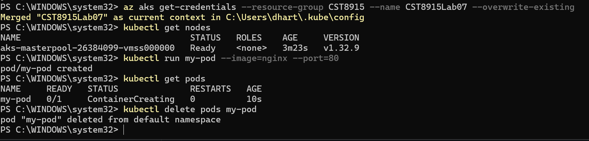
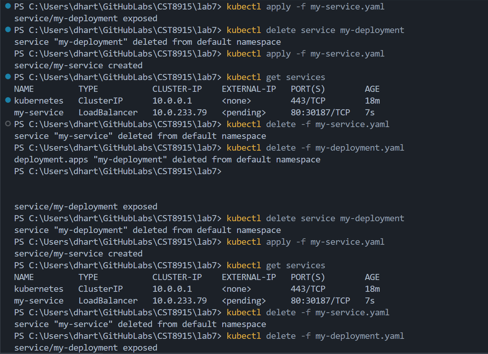
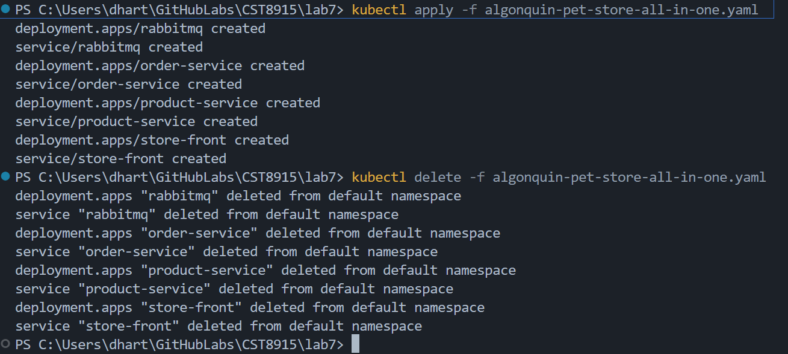

https://youtu.be/5hW5XM4nSqs

### 1. Is RabbitMQ stateless or stateful?

RabbitMQ is stateful because it needs to save its data.

### 2. Implications of running RabbitMQ without persistent storage

If there’s no storage, RabbitMQ loses everything when it restarts.

### 3. What happens when the RabbitMQ pod is deleted or restarted?

All messages and data disappear when the pod restarts.

### 4. Potential solutions

Give RabbitMQ a persistent volume so it can save its data.

###  5. Does Azure Service Bus solve the problem?

Yes, Azure Service Bus keeps messages safely, even if something restarts.